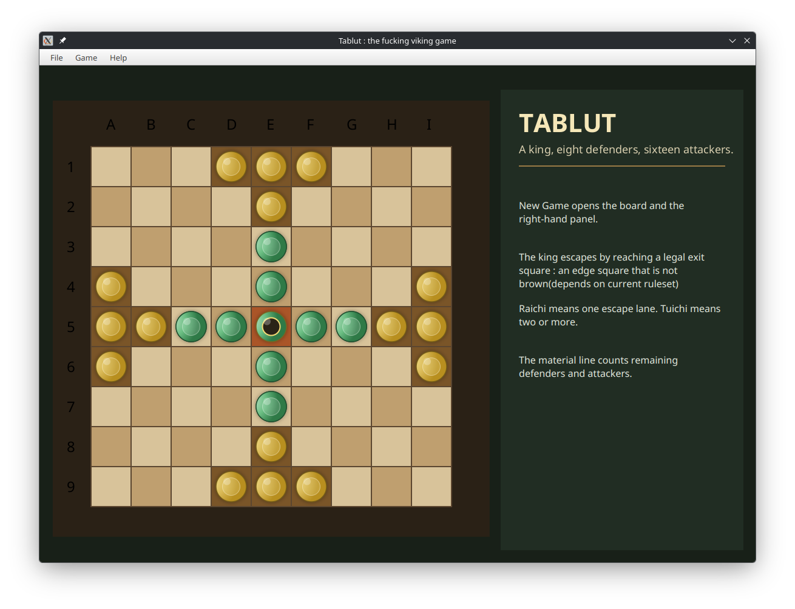
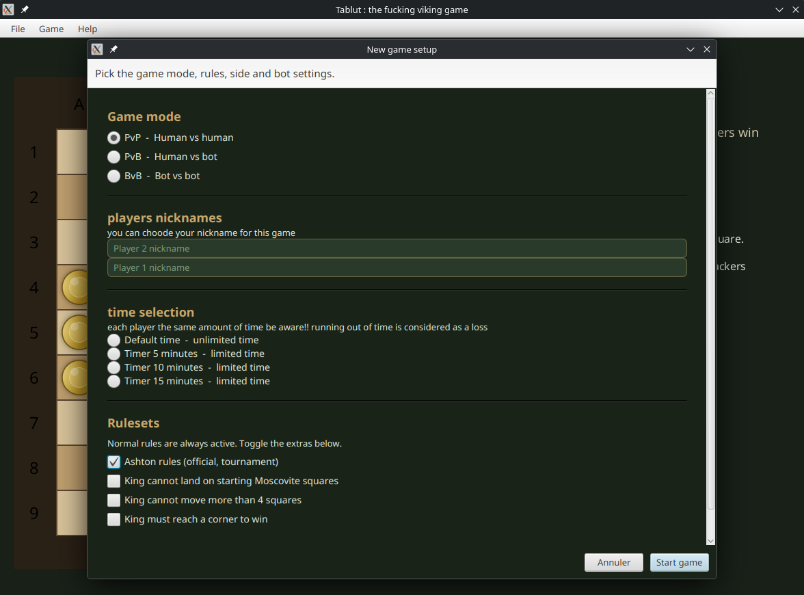
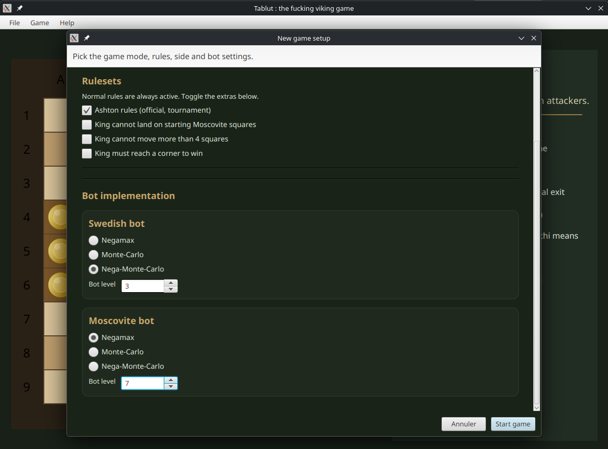

# Tablut game
Final project in first year of bachelor in IT using Java with JavaFX

## Principal
Swedishs (green) must put their king on one of the board's border without being captured by the Muscovites (yellow)

## Available variants
- King cannot land on starting Muscovite squares
- King cannot move more than 4 squares
- King must reach a corner to win
- Ashton rules (official, turnaments)

## Bots available
- Negamax
- Monte-Carlo
- Nega-Monte-Carlo (a mix of the two previous ones)
- O(sarracino) (https://github.com/federico-terzi/osarracino)

## Start a game
In order to start a new game, you have to ensure you have java >11 installed with the javaFX SDK corresponding. 
Once it is, you can start the programm with : 
java --module-path PATH_TO_JAVAFX/lib --add-modules javafx.controls,javafx.fxml,javafx.graphics PATH_TO_TABLUT/src/main/java/Tablut.java

## Example pictures

## Students
- Mohamed Bouoiararne
- Mathis Guihot
- Damien Lugbull
- Antoine Mecenero--Chretien 
May 2026 - June 2026
